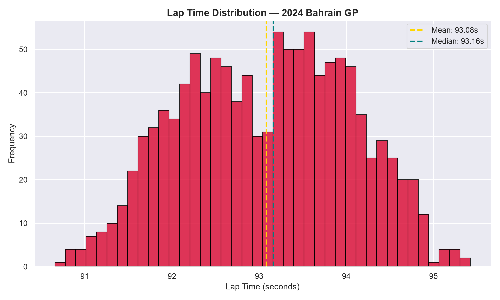
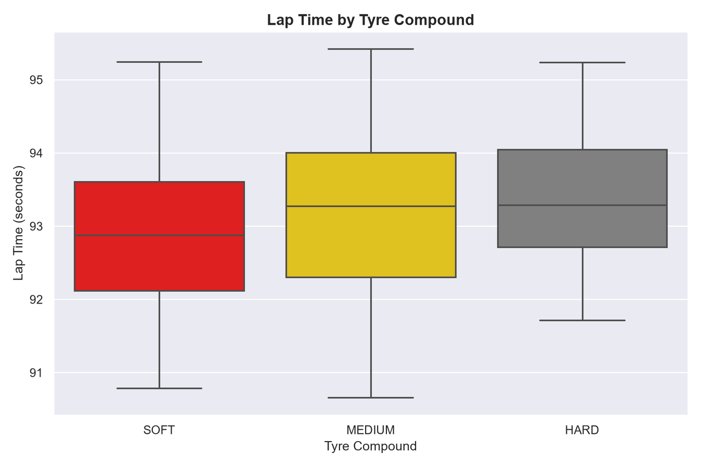
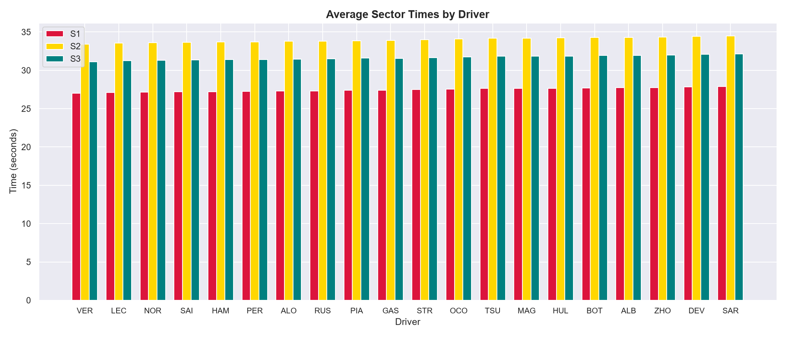
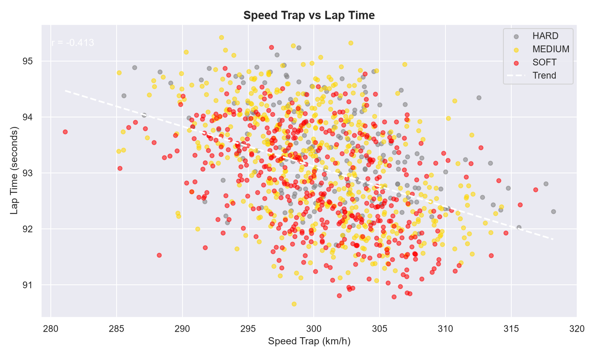
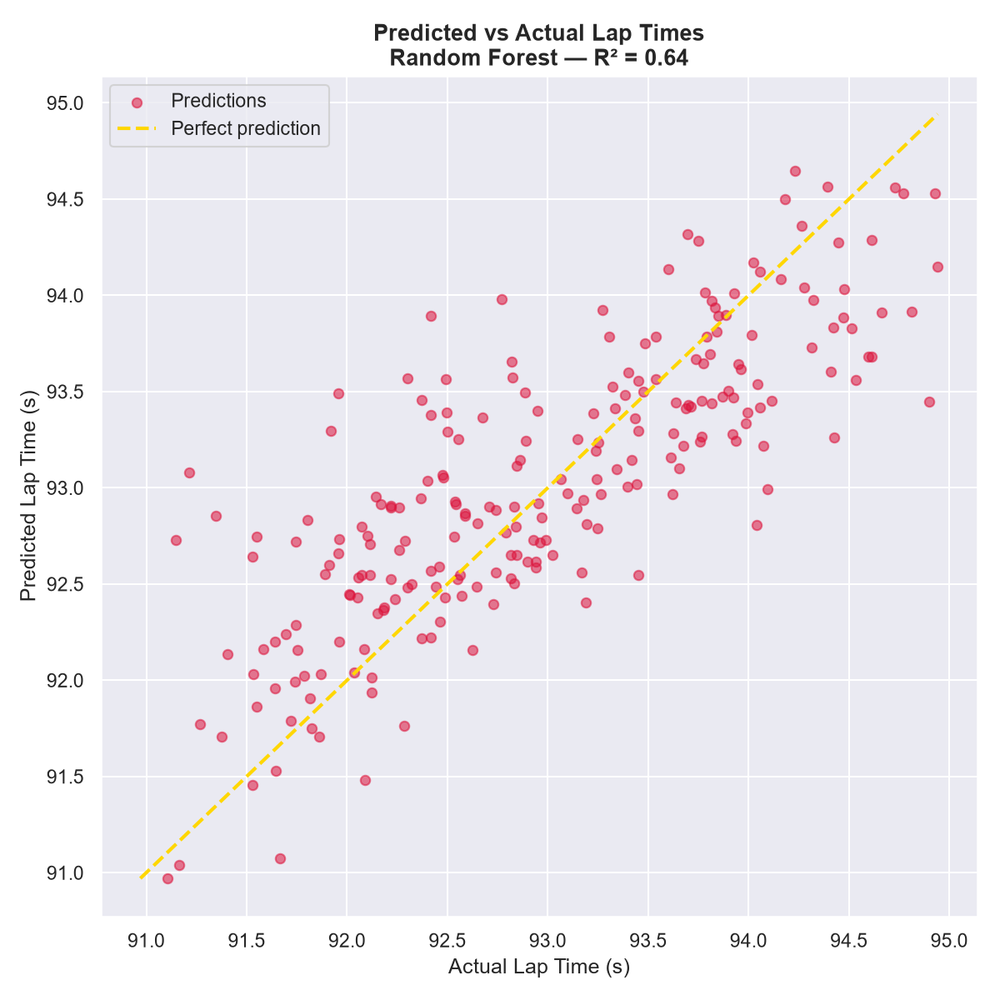
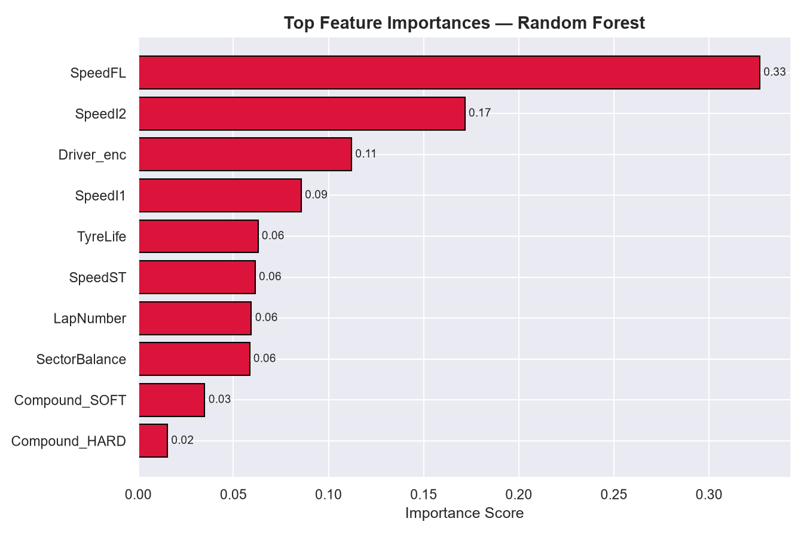
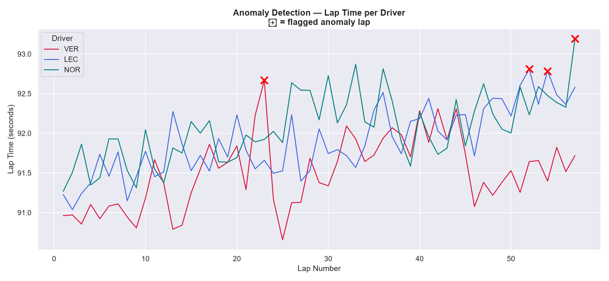

# F1 Race Performance — AI/ML Analysis

A complete data science pipeline for analysing 2024 Bahrain GP lap timing data,
built for the DataCore Analytics intern assignment.

## What It Does
- Loads & cleans F1 lap timing data via the FastF1 API
- Performs EDA: lap time distributions, tyre compound comparison, sector analysis
- Engineers features and trains a Random Forest Regressor to predict lap times
- Detects anomalous laps using a 2-sigma statistical threshold

## Stack
Python · Pandas · NumPy · Scikit-learn · Matplotlib · Seaborn · FastF1

## Installation
```bash
pip install fastf1 pandas numpy scikit-learn matplotlib seaborn
```

## How to Run
```bash
python f1_analysis.py
```
All plots are saved to the `plots/` folder automatically.

## Sample Outputs

### Lap Time Distribution


### Tyre Compound Comparison


### Sector Times by Driver


### Speed vs Lap Time


### Predicted vs Actual


### Feature Importance


### Anomaly Detection



## Project Structure
```
f1-aiml-analysis/
├── f1_analysis.py
├── plots/
│   ├── lap_distribution.png
│   ├── compound_boxplot.png
│   ├── sector_comparison.png
│   ├── speed_correlation.png
│   ├── predicted_vs_actual.png
│   ├── feature_importance.png
│   └── anomaly_detection.png
├── .gitignore
└── README.md
```
